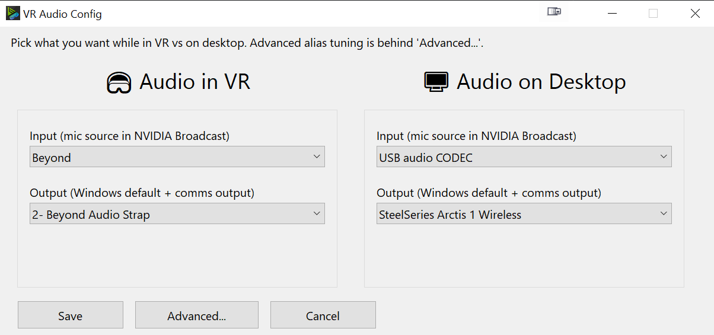
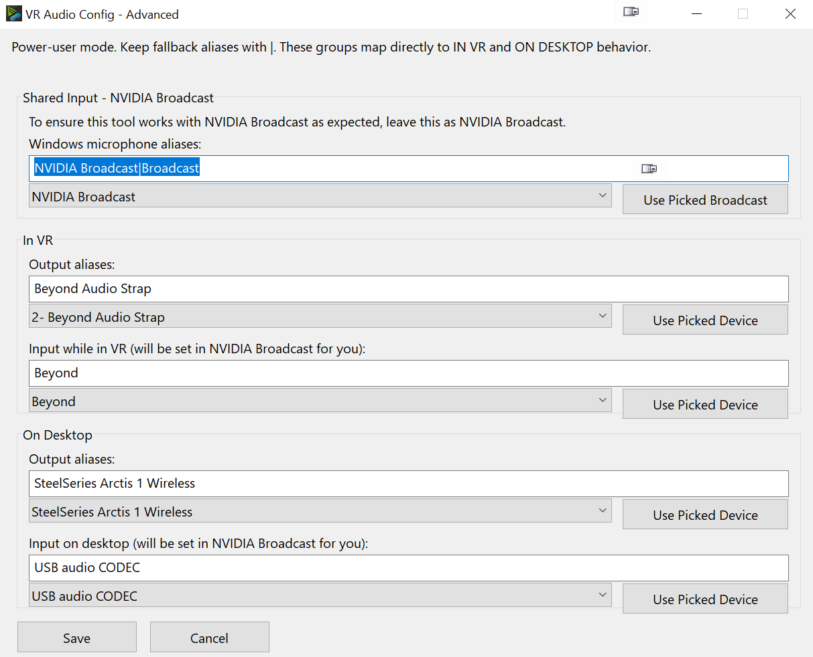

# SteamVR + NVIDIA Broadcast mic source sync

AutoHotkey v2 script: `autoswitch mic for VR.ahk`. It watches SteamVR and keeps **NVIDIA Broadcast v1**'s **microphone source dropdown** aligned with VR vs desktop use, while also setting Windows default and communications devices where needed (for example Discord splitting default vs comms).

**Repository:** `nvbroadcast-steamvr-sync`

**Suggested GitHub description** (About field):

> SteamVR-triggered automation for NVIDIA Broadcast v1 mic source + Windows audio defaults. Requires Broadcast 1.x; not compatible with Broadcast 2.x.

## Why this exists (the actual novelty)

- **SteamVR already exposes VR session audio settings** for many setups. If your only problem were picking headset vs speakers, you would not need this repo.
- **Generic "audio switcher" tools** are everywhere. They are great at flipping Windows endpoints. They do not reliably drive **Broadcast's own UI state** - specifically the **mic source** list inside Broadcast.
- **NVIDIA Broadcast is the awkward piece**: it sits between physical mics and apps. When you enter or leave VR, you often need Broadcast to point at a different physical input. Broadcast does not follow SteamVR the way endpoints do, so you end up with **Broadcast and Windows disagreeing** unless something updates Broadcast explicitly.

This tool exists to automate **that Broadcast integration**, with SteamVR start/stop as the trigger, plus the Windows default/comms tweaks that tend to matter for real sessions (especially comms routing).

## Requirements

- AutoHotkey v2
- **NVIDIA Broadcast v1** - this workflow targets the v1 app only.

  Download (official): [NVIDIA_Broadcast_Offline_Ada_v1.4.0.38.exe](https://international.download.nvidia.com/Windows/broadcast/1.4.0.38/NVIDIA_Broadcast_Offline_Ada_v1.4.0.38.exe)

### Broadcast 2.x

**NVIDIA Broadcast 2.x is not supported.** The automation approach used here does not work with Broadcast 2.x, so this project effectively **depends on staying on Broadcast v1** for as long as you use it.

If you require Broadcast 2.x, treat this tool as a dead end until someone finds a supported approach (do not expect it).

### If NVIDIA stops hosting v1

NVIDIA may stop hosting old installers. Keep a **personal copy** of the v1 offline installer from the official link above, plus a **SHA-256** checksum if you want to verify copies later.

## What it automates

- Windows default audio playback device
- Windows default communications playback device
- **NVIDIA Broadcast microphone source** (dropdown selection)

## Quick start

1. Put `autoswitch mic for VR.exe` (or `.ahk`) beside `SoundVolumeView.exe` and `nircmd.exe`.
2. Run it once.
3. On first run, if `autoswitch mic for VR.ini` does not exist yet, the config window now opens automatically for onboarding.
4. Pick your `Audio in VR` and `Audio on Desktop` targets, then click `Save`.

## VR Audio Config UI

Main config window:

Advanced config window:

## Build and run (local)

- Compile from repo root with:
  - `.\build-exe.ps1`
  - or one-click wrapper: `.\build-and-run.bat`
- This build script always uses `images/beyond_nvidia.ico` for the EXE icon.
- Deploy and run the compiled EXE from your own chosen runtime folder.

## Windows default vs communications

Windows separates "default device" and "default communications device." Many apps (notably Discord) use comms routing in ways that feel random if you only set one of them. This script sets **both** when it applies Windows-side changes, to avoid half-switched audio.

## Example behavior (defaults in this project)

When SteamVR starts:

- Windows default input and comms input -> `NVIDIA Broadcast`
- NVIDIA Broadcast mic source -> item containing `Beyond`
- Windows default output and comms output -> Beyond strap device (matched by aliases)

When SteamVR stops:

- Windows default input and comms input remain -> `NVIDIA Broadcast`
- NVIDIA Broadcast mic source -> item containing `USB audio CODEC`
- Windows default output and comms output -> `SteelSeries Arctis 1 Wireless`

Your machine will differ - configure via the UI and INI.

## Customize for your setup

You can configure this without touching code:

1. Right-click the tray icon for `autoswitch mic for VR.exe`
2. Click `Configure VR Audio Targets...`
3. In the main screen, use the left `Audio in VR` panel and right `Audio on Desktop` panel to pick:
   - Input
   - Output
4. Save

Use `Advanced...` only if you want alias-level tuning and fallback patterns.

Advanced mode is grouped by:

- `In VR`
- `On Desktop`
- Shared NVIDIA Broadcast input defaults

Settings are stored in `autoswitch mic for VR.ini` next to the script/exe.

Use stable substrings, not exact full names. Windows may prepend changing prefixes like `2-` or `3-`.

Alias fields support pipe-delimited fallback values, for example:

- `Beyond|YondBe|Strap`
- `SteelSeries Arctis 1 Wireless|Arctis 1 Wireless|SteelSeries`

## Virtual Desktop stand-down

If Virtual Desktop is running, this tool intentionally stands down and does not change audio routing.

- Tray status changes to stand-down mode
- Config windows show a loud warning that the tool is not active
- This avoids fighting Virtual Desktop, which already manages VR audio paths

## Tooling

The script prefers `SoundVolumeView.exe` (for unique device IDs), then falls back to `nircmd.exe`.

Keep these files next to the script/exe:

- `SoundVolumeView.exe` - [tool page](https://www.nirsoft.net/utils/sound_volume_view.html) - [direct download (x64 zip)](https://www.nirsoft.net/utils/soundvolumeview-x64.zip)
- `nircmd.exe` - [tool page](https://www.nirsoft.net/utils/nircmd.html) - [direct download (zip)](https://www.nirsoft.net/utils/nircmd.zip)

`SoundVolumeView.exe` is used first because it can target unique audio device IDs and avoid ambiguous labels like multiple `Speakers` devices.

## Git LFS

This repository uses Git LFS for large binary archives. After cloning, run `git lfs pull` if you need full LFS objects locally. Cloning without Git LFS still yields the AutoHotkey sources; release builds do not depend on LFS objects.

Redistribution of NVIDIA software may be restricted by NVIDIA's license; treat any in-repo copy as archival backup only, not a distribution channel.
